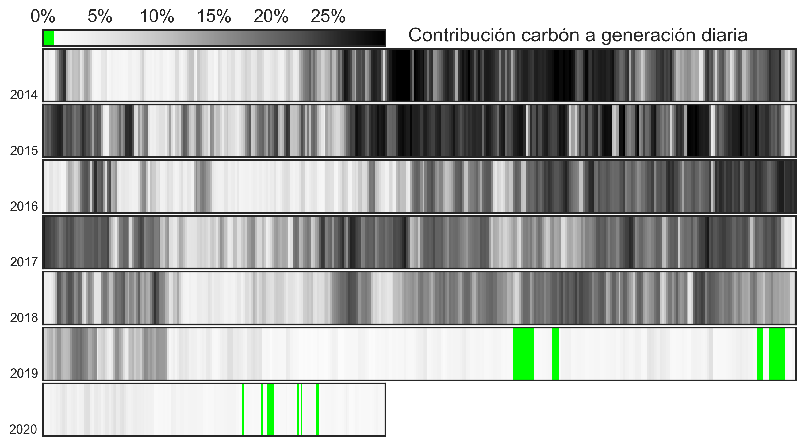
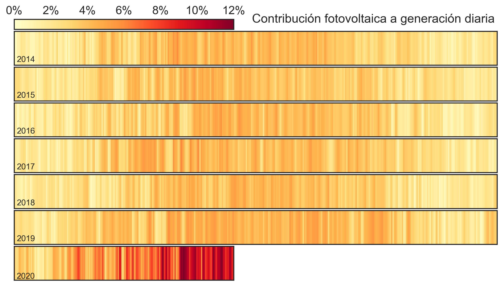
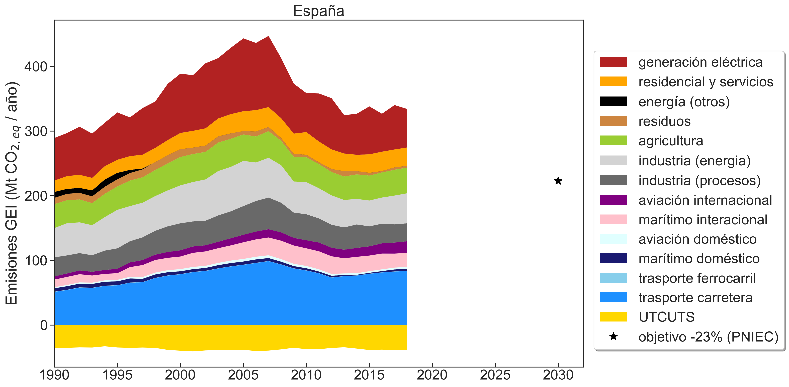
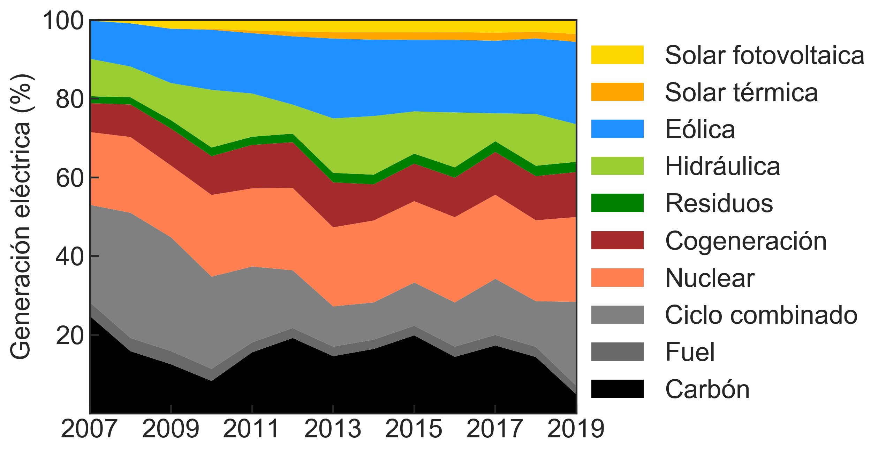

## El carbón está desapareciendo rápidamente del mix eléctrico (afortunadamente)

&nbsp;

&nbsp;

## La generación fotovoltaica ya cubre el 12% de la demanda algunos días

&nbsp;

&nbsp;

## Evolución histórica de emisiones de CO2 por sectores

&nbsp;

&nbsp;

## El mix de generación eléctrica está cambiando

&nbsp;

&nbsp;

## Eliminar el carbón y el gas en el sector residencial es particularmente difícil

&nbsp;

&nbsp;

## Más información

 

Todas las figuras incluidas en esta página tienen Copyright © 2020 Marta Victoria <mvp@eng.au.dk> y están sujetas a una licencia [Creative Commons Attribution 4.0 International Licence Attribution-NonCommercial-ShareAlike 4.0 International (CC BY-NC-SA 4.0)](https://creativecommons.org/licenses/by-nc-sa/4.0/)

Los scripts utilizados para generar las figuras que se muestran en esta página pueden encontrarse en el directorio [scripts/](https://github.com/transicion-energetica-visual/transicion-energetica-visual.github.io/tree/master/scripts). Todos los scripts están sujetos licencia GPLv3.

Si tienes algunas ideas puedes enviarme un mail o directamente crear un [pull request](https://opensource.com/article/19/7/create-pull-request-github) en el repositorio.
