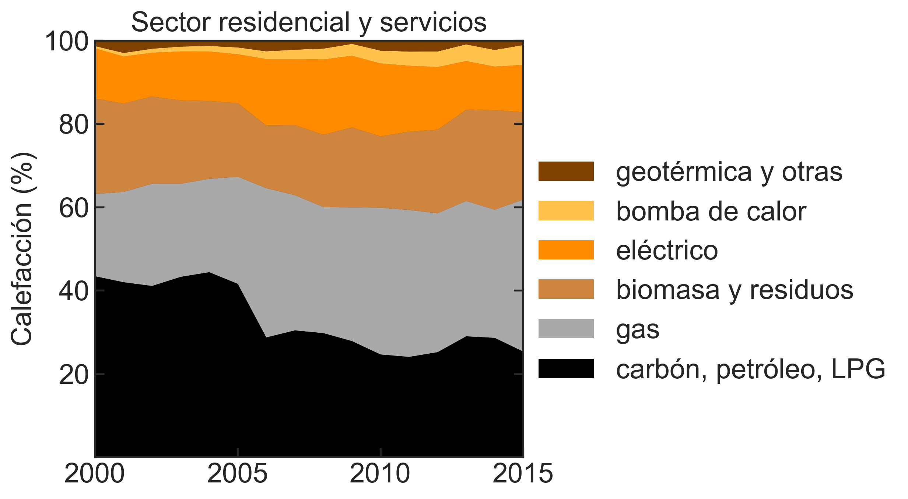

## El carbón está desapareciendo rápidamente del mix eléctrico (afortunadamente)

&nbsp;

&nbsp;

## La generación fotovoltaica ya cubre el 12% de la demanda algunos días

&nbsp;

&nbsp;

## Evolución histórica de emisiones de CO_2 por sectores

&nbsp;

&nbsp;

## El mix de generación eléctrica está cambiando

&nbsp;

&nbsp;

&nbsp;

## Eliminar el carbón y el gas en el sector residencial es particularmente difícil

